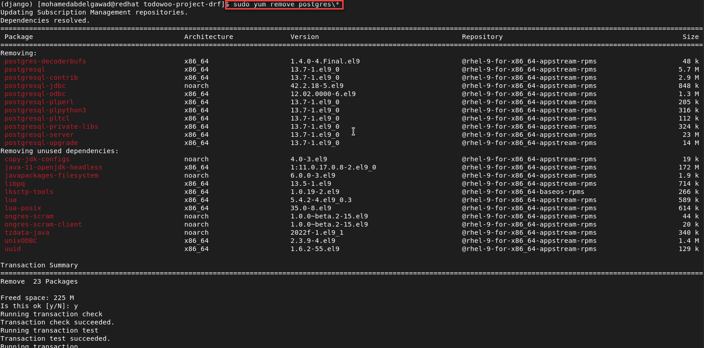

<!-- PROJECT SHIELDS -->
<!--
*** I'm using markdown "reference style" links for readability.
*** Reference links are enclosed in brackets [ ] instead of parentheses ( ).
*** See the bottom of this document for the declaration of the reference variables
*** for contributors-url, forks-url, etc. This is an optional, concise syntax you may use.
*** https://www.markdownguide.org/basic-syntax/#reference-style-links
-->

[![LinkedIn][linkedin-shield]][linkedin-url]

<!-- PROJECT LOGO -->
 

    

  <h3 align="center">Red Hat Enterprise Linux Practice</h3>

<!-- TABLE OF CONTENTS -->

  
Table of Contents

  <ol>
    <li>
      <a href="#about-the-project">About The Project</a>
      <ul>
        <li><a href="#built-with">Built With</a></li>
      </ul>
    </li>
    <li><a href="#roadmap">Roadmap</a></li>
    <li><a href="#license">License</a></li>
    <li><a href="#contact">Contact</a></li>
  </ol>

<!-- ABOUT THE PROJECT -->
## About The Project

![cover]

* Project Name: Red Hat Enterprise Linux Practice
* Version: v1.0.0
* Organization Department: Technology

### Description
Since I am using a RedHat Enterprise Linux server at work, I thought it 
would be a good idea to install a similar server in VMware Work Station 
and explore it on my own. I documented all the actions and commands I have 
done with screenshots; so that I can use it as a reference.
* 
* Installation

* OS name and its details

* Disable the Sudo user's password

* Change hostname and reboot

* Register system with RedHat account

* SSH VM in VMware

* Turn off the beep sound for the VM in VMware

* Where python is installed

* Symlinks or Symbolic links

* Update already installed packages

* Search Linux packages

* Current installed Python version

* Install Python 3.9 package

* Install the Python Devel package

* Install Nginx package

* Install PostgreSQL package

* Install Python3 pip package

* Install supervisor Python package

* Install virtualenv Python pacakge

* Create virtual environment and activate it

* Install Git package

* Clone Django project

* Install Django project's requirements

* Make database migrations for Django project

* Uninstall PostgreSQL

* Reinstall PostgreSQL

* Shutdown server

(<a href="#readme-top">back to top</a>)

### Built With

This project was developed using the following tech stacks:

* RedHat Enterprise Linux

(<a href="#readme-top">back to top</a>)

<!-- ROADMAP -->
## Roadmap

- [x] Installation
- [x] OS name and its details
- [x] Disable the Sudo user's password
- [x] Change hostname and reboot
- [x] Register system with RedHat account
- [x] SSH VM in VMware
- [x] Turn off the beep sound for the VM in VMware
- [x] Where python is installed
- [x] Symlinks or Symbolic links
- [x] Update already installed packages
- [x] Search Linux packages
- [x] Current installed Python version
- [x] Install Python 3.9 package
- [x] Install the Python Devel package
- [x] Install Nginx package
- [x] Install PostgreSQL package
- [x] Install the Python3 pip package
- [x] Install the supervisor Python package
- [x] Install virtualenv Python pacakge
- [x] Create a virtual environment and activate it
- [x] Install Git package
- [x] Clone Django project
- [x] Install Django project's requirements
- [x] Make database migrations for the Django project
- [x] Uninstall PostgreSQL
- [x] Reinstall PostgreSQL
- [x] Shutdown server

(<a href="#readme-top">back to top</a>)

<!-- LICENSE -->
## License

Distributed under the MIT License. See `LICENSE.txt` for more information.

(<a href="#readme-top">back to top</a>)

<!-- CONTACT -->
## Contact

Mohamed AbdelGawad Ibrahim - [@m-abdelgawad](https://www.linkedin.com/in/m-abdelgawad/) - +201069052620 - muhammadabdelgawwad@gmail.com

Github Profile Link: [https://github.com/m-abdelgawad](https://github.com/m-abdelgawad)

(<a href="#readme-top">back to top</a>)

<!-- MARKDOWN LINKS & IMAGES -->
<!-- https://www.markdownguide.org/basic-syntax/#reference-style-links -->
[linkedin-shield]: https://img.shields.io/badge/-LinkedIn-black.svg?style=for-the-badge&logo=linkedin&colorB=555
[linkedin-url]: https://www.linkedin.com/in/m-abdelgawad/
[cover]: images/cover.jpg
